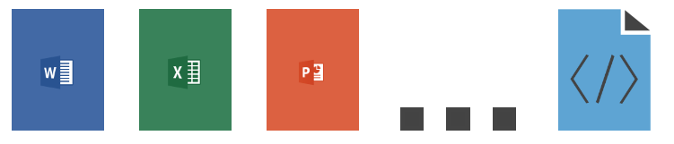

# Origine de la démarche "DocsAsCode"

---

En 2015, lors d’une conférence aux États-Unis de la communauté « Write the
Docs », Riona McNamara, rédactrice technique chez Google, présente la
démarche qui leur a permis de révolutionner leur façon de faire de la
documentation technique à l’aide d’un dépôt de code source, d’améliorer la
collaboration avec les ingénieurs et d’obtenir des gains en termes de
qualité et d’efficacité.  
Par la suite, de nombreux autres acteurs ont embrassé la démarche :
OpenStack, Cisco Systems, Rackspace, Microsoft, Balsamiq, Twitter, etc.
