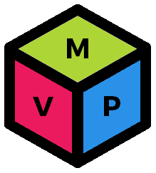

# Définition d'un MVP DevSecOps

---

## Objectif

Il s'agit de définir les pratiques minimales à intégrer à l'équipe pour pouvoir
dire que l'on est un conforme à un début de DevSecOps.

---

## Les 3 axes : personnes, outils et processus

Bien souvent on présente les 3 axes de DevSecOps pour expliquer en quoi ce
dernier consiste.

Cela donne l'impression que les 3 axes sont indépendants et que l'on peut
agir sur chacun à part.

**C'est faux et c'est une mauvaise compréhension.**

En réalité les axes ne vont pas l'un sans l'autre et se soutiennent.

---

## Exemple

Prenons l'exemple de la revue par les pairs.
Une revue par les pairs systématique soutient les valeurs de responsabilité
collective, de transparence.

---

## Constat

Si les **_personnes_** n'y adhèrent pas, cela ne fonctionne pas. Car le
changement de culture ne s'opérera pas s'il les choses sont faites à contre-
cœur.

S'il n'y pas de **_processus_** systématisé, cela ne fonctionne pas. Les gens
finiront par arrêter de le faire et arrêter de le suivre, ou le feront chaque
fois de manière différente.

S'il n'y a pas d'**_outils_** permettant l'automatisation et le soutien
de cette pratique, cela tombera à l'eau. Les gens arrêteront de le faire si
cela devient fastidieux.

C'est la raison pour laquelle il faut définir des pratiques qui couvrent et
soutiennent le tout en même temps.

---

## Pratiques minimales DevSecOps

Pour commencer à être DevSecOps, l'équipe doit :

- Se mesurer dès le premier jour, avec les 4 métriques de base (Lead time,
fréquence de livraison, taux d'échecs de livraison, MTTR)
- Implanter un processus systématique de revue par les pairs
- Implanter des mécanismes d'automatisation pour la vérification de ce qu'elle
produit
- Introduire des événements de tests d'échec pour mesurer son MTTR
